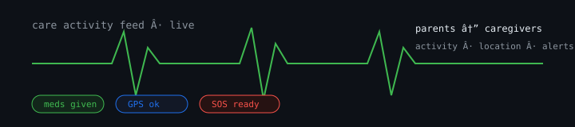

# CareConnect

Real-time care coordination for parents and caregivers. Activity logs, location, emergency alerts, handoff notes.

## Features

- Live activity feed (meals, meds, naps, incidents)
- GPS check-ins and geofenced alerts
- Emergency SOS broadcast to caregivers
- Multi-caregiver handoff notes
- Offline-tolerant cache with sync

## Stack

React 19, TypeScript, Vite, Tailwind CSS, Supabase, Leaflet.

## Run locally

    npm install
    npm run dev

## License

MIT
